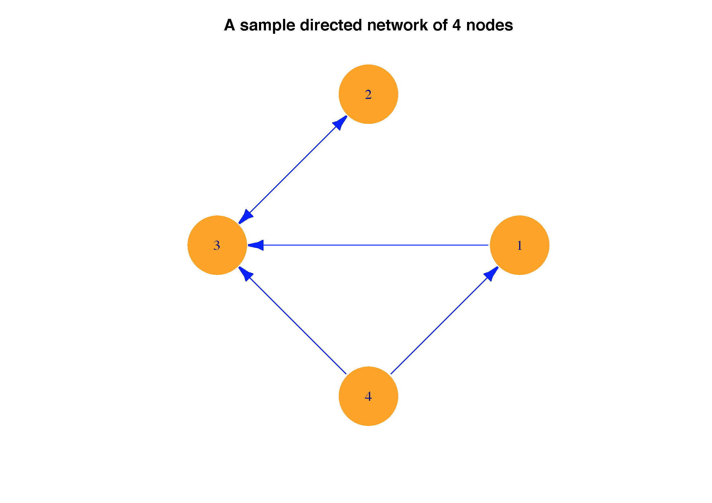
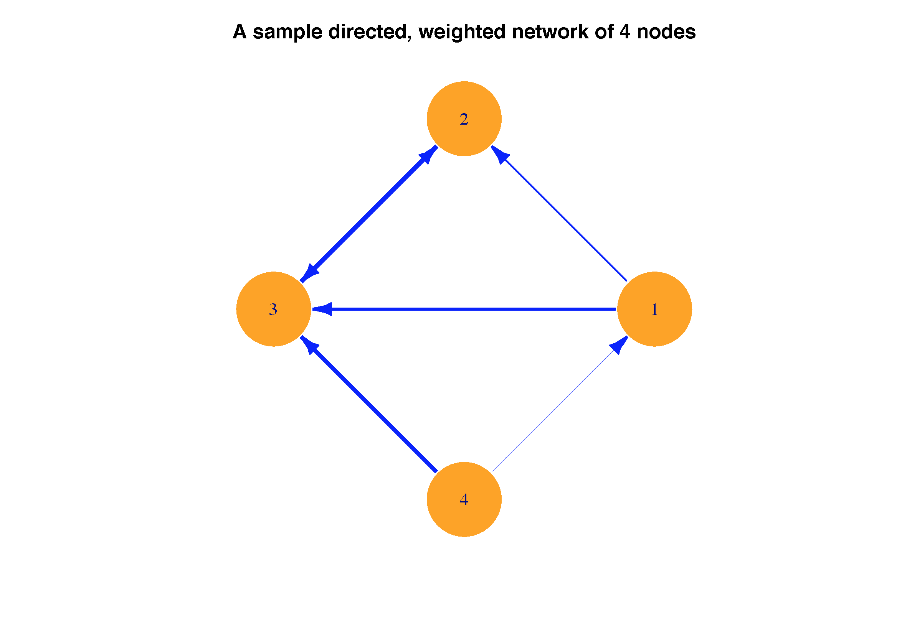
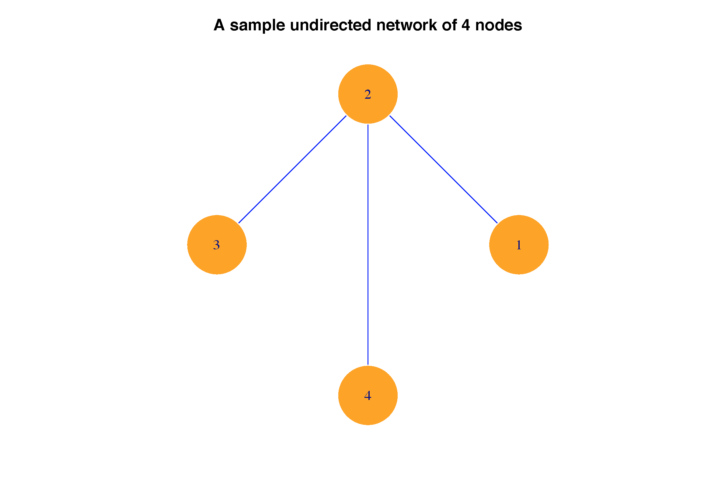

[](http://quantlet.de/)

## [](http://quantlet.de/) **METISNET-adjtonet** [](http://quantlet.de/)

```yaml

Name of QuantLet : METISNET-adjtonet

Published in : METIS

Description : Transfer adjacency matrices to network plots

Keywords : plot, network, adjacency matrix, directed, weighted

Author : Ya Qian

Submitted : Ya Qian

Input : Adjacency matrices

Output : Network plots of the corresponding adjacency matrices

```








### R Code:
```r
#Close windows and clear variables                                                                   
graphics.off()
rm(list = ls(all=TRUE))

# install and load packages
libraries = c("igraph")
lapply(libraries, function(x) if (!(x %in% installed.packages())) {
  install.packages(x)})
lapply(libraries, library, quietly = TRUE, character.only = TRUE)

# construct adjacency matrices
Adjac1           = matrix(c(0,1,0,0,1,0,1,1,0,1,0,0,0,1,0,0),4,4)
Adjac2           = matrix(c(0,0,0,1,0,0,1,0,1,1,0,1,0,0,0,0),4,4)
Adjac3           = matrix(c(0,0,0,0.1,0.3,0,1,0,0.7,1,0,0.9,0,0,0,0),4,4)

#name the nodes
colnames(Adjac1) = c("1", "2", "3", "4")
colnames(Adjac2) = c("1", "2", "3", "4")
colnames(Adjac3) = c("1", "2", "3", "4")

#plot the networks from adjacency matrices
Graph1           = graph_from_adjacency_matrix(Adjac1, mode = "undirected", weighted = NULL, diag = TRUE,
                                     add.colnames = TRUE)
lay1             = layout.circle(Graph1)
plot.igraph(Graph1, main = "A sample symmetric, undirected network of 4 nodes", edge.color="blue", edge.arrow.size = 0.2,  
     vertex.size = 40, vertex.label.cex = 2.0, vertex.color="orange", vertex.frame.color="#ffffff", 
     layout = lay1, edge.width = E(Graph1)$weight*5)

Graph2           = graph_from_adjacency_matrix(Adjac2, mode = "directed", weighted = NULL, diag = TRUE,
                                     add.colnames = TRUE)
lay2             = layout.circle(Graph2)
plot.igraph(Graph2, main = "A sample directed, unweighted network of 4 nodes", edge.color="blue", edge.arrow.size = 0.2,  
            vertex.size = 40, vertex.label.cex = 2.0,  vertex.color="orange", vertex.frame.color="#ffffff", 
            layout = lay2, edge.width = E(Graph2)$weight*5)

Graph3           = graph_from_adjacency_matrix(Adjac3, mode = "directed", weighted = TRUE, diag = TRUE,
                                     add.colnames = TRUE)
lay3             = layout.circle(Graph3)
plot.igraph(Graph3, main = "A sample directed, weighted network of 4 nodes", edge.color="blue", edge.arrow.size = 0.2,  
            vertex.size = 40, vertex.label.cex = 2.0,  vertex.color="orange", vertex.frame.color="#ffffff", 
            layout = lay3, edge.width = E(Graph3)$weight*5)
```
