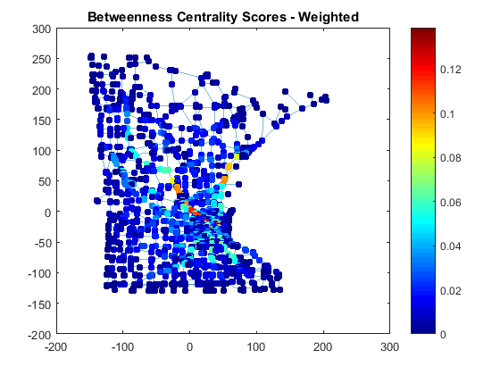
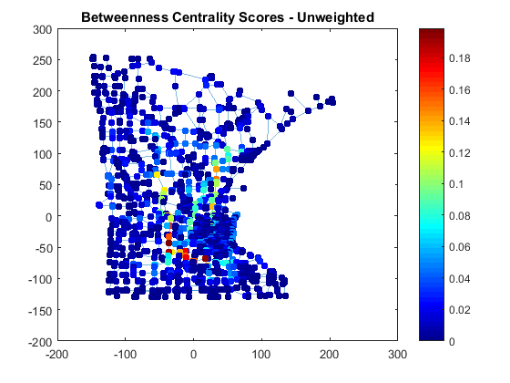
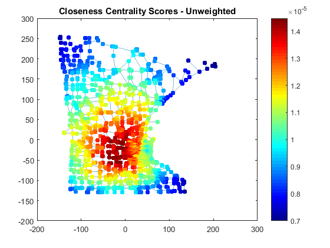
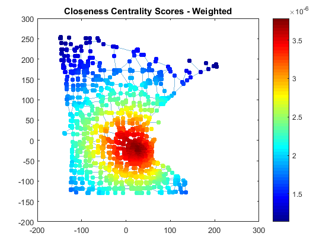
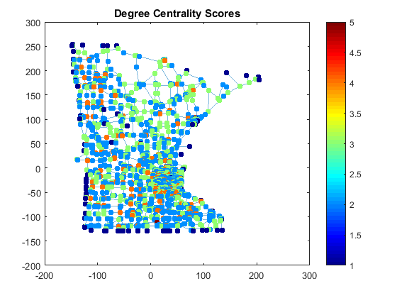
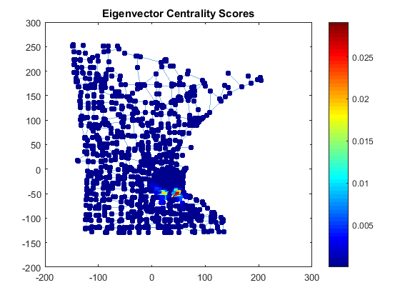

[](http://quantlet.de/)

## [](http://quantlet.de/) **METISNET-centralitycomparison** [](http://quantlet.de/)

```yaml

Name of QuantLet : METISNET-centralitycomparison

Published in : METIS

Description : Compare network centralities using the example of Minnesota road network

Keywords : network, plot, comparison, centrality, Minnesota road network

Author : MathWorks

Submitted : Ya Qian

Datafile : minnesota.mat

Output : Plots of Minnesota road network displayed in different centrality measures

```














### MATLAB Code:
```matlab

%% load data and plot without centrality
data = load(fullfile(matlabroot,'examples','matlab','minnesota.mat'))
xy = [G.Nodes.XCoord G.Nodes.YCoord];
[s,t] = findedge(G);
G.Edges.Weight = hypot(xy(s,1)-xy(t,1), xy(s,2)-xy(t,2));
p = plot(G,'XData',xy(:,1),'YData',xy(:,2),'MarkerSize',5);
title('Minnesota Road Network')

%% Degree centrality
udc = centrality(G,'degree');
p.NodeCData = udc;
colormap jet
colorbar
title('Degree Centrality Scores')

%% unweighted closeness centrality
ucc = centrality(G,'closeness');
p.NodeCData = ucc;
title('Closeness Centrality Scores - Unweighted')

%% weighted closeness centrality
wcc = centrality(G,'closeness','Cost',G.Edges.Weight);
p.NodeCData = wcc;
title('Closeness Centrality Scores - Weighted')

%% unweighted betweenness centrality
ubc = centrality(G,'betweenness');
n = numnodes(G);
p.NodeCData = 2*ubc./((n-2)*(n-1));
title('Betweenness Centrality Scores - Unweighted')

%% weighted betweenness centrality
wbc = centrality(G,'betweenness','Cost',G.Edges.Weight);
n = numnodes(G);
p.NodeCData = 2*wbc./((n-2)*(n-1));
%colormap(flip(autumn,1));
title('Betweenness Centrality Scores - Weighted')

%% Eigenvector centrality
uec = centrality(G,'eigenvector');
p.NodeCData = uec;
title('Eigenvector Centrality Scores')

%% Pagerank centrality
upc = centrality(G,'pagerank');
p.NodeCData = upc;
title('Pagerank Centrality Scores')


```
