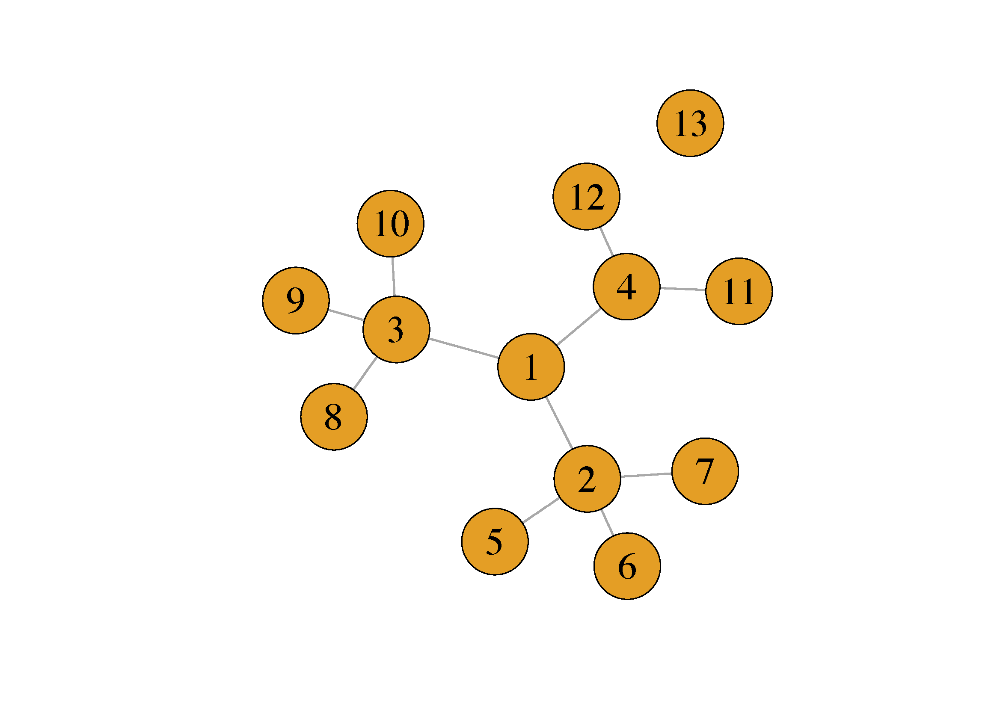
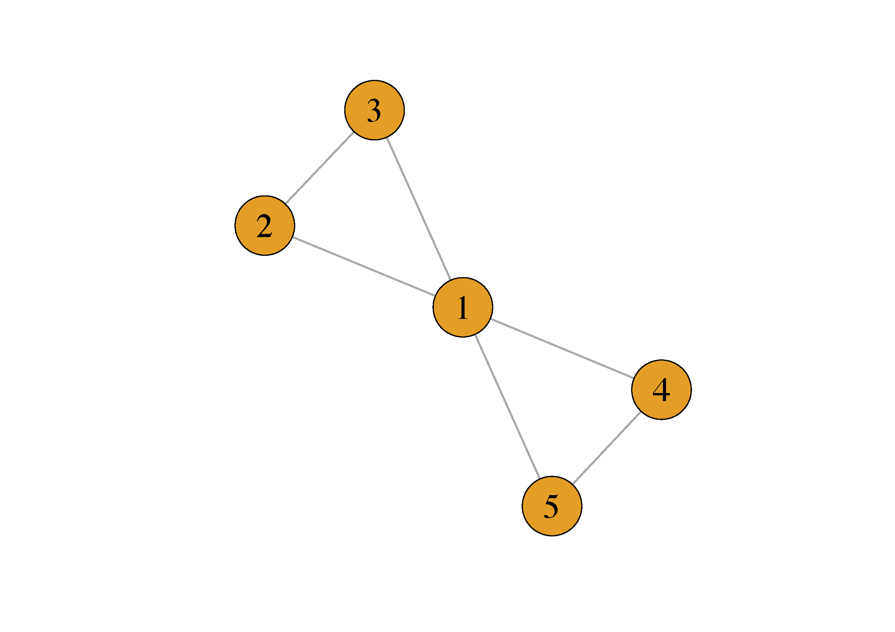
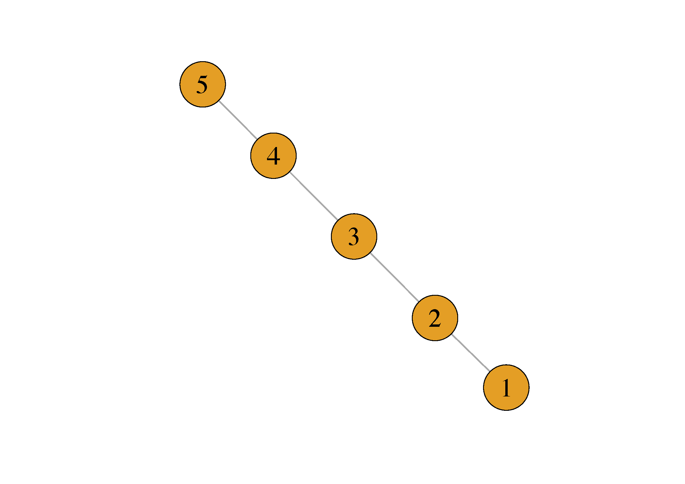
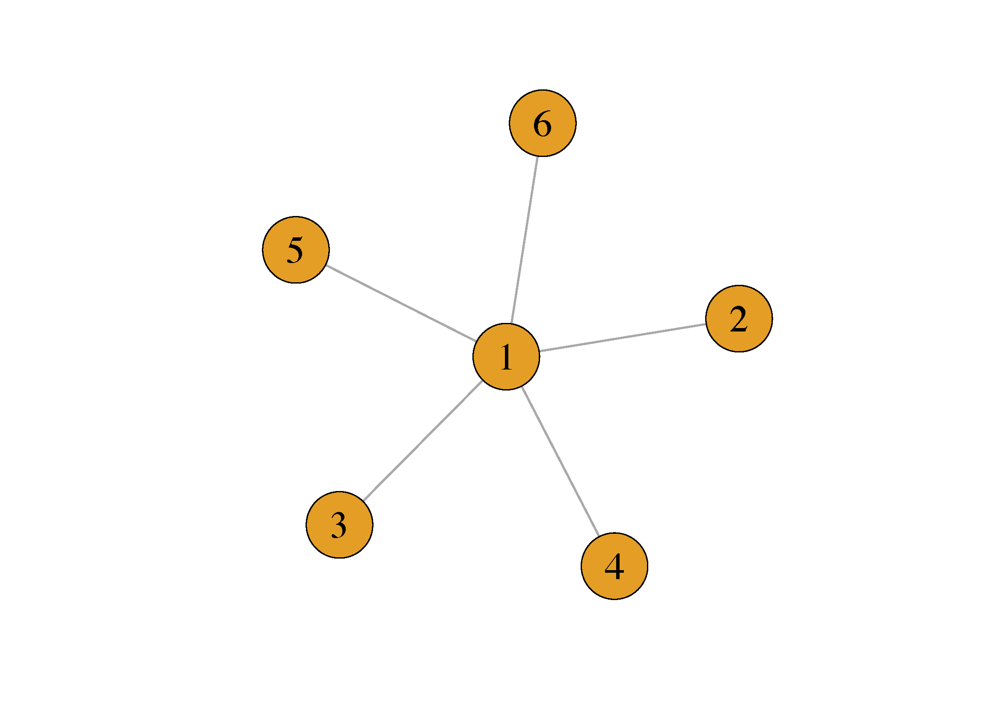

[](http://quantlet.de/)

## [](http://quantlet.de/) **METISNET-centralitymeasures** [](http://quantlet.de/)

```yaml

Name of QuantLet : METISNET-centralitymeasures

Published in : METIS

Description : Give a few examples of centrality calculation

Keywords : plot, network, adjacency matrix, centrality, weighted

Author : Ya Qian

Submitted : Ya Qian

Input : Adjacency matrices

Output : Network plots of the corresponding adjacency matrices and their centralities

```










### R Code:
```r
#Close windows and clear variables                                                                   
graphics.off()
rm(list = ls(all=TRUE))

# install and load packages
libraries = c("igraph")
lapply(libraries, function(x) if (!(x %in% installed.packages())) {
  install.packages(x)})
lapply(libraries, library, quietly = TRUE, character.only = TRUE)

# Example 1
# plot the network
g1        = graph(edges = c(1,2,1,3,1,4,1,5,1,6), n = 6, directed = FALSE)
plot(g1, vertex.size = 30, vertex.label.cex = 2.0, 
     edge.width = 2, vertex.label.color = "black")

# calculate the centrality measures
# degree centrality
dc1       = degree(g1)
# closeness centrality
cc1       = closeness(g1, normalized = TRUE)
# betweenness centrality
bc1       = betweenness(g1, normalized = TRUE)
# eigenvector centrality
ec1list   = eigen_centrality(g1, scale = FALSE)
ec1       = ec1list$vector


# Example 2
# plot the network
g2        = graph(edges= c(1,2,2,3,3,4,4,5), n = 5, directed = FALSE)
plot(g2, vertex.size = 30, vertex.label.cex = 2.0, 
     edge.width = 2, vertex.label.color="black")

# calculate the centrality measures
# degree centrality
dc2       = degree(g2)
# closeness centrality
cc2       = closeness(g2, normalized = TRUE)
# betweenness centrality
bc2       = betweenness(g2, normalized = TRUE)
# eigenvector centrality
ec2list   = eigen_centrality(g2, scale = FALSE)
ec2       = ec2list$vector

# Example 3
# plot the network
g3        = graph(edges= c(1,2,2,3,3,4,4,5), n = 5, directed = FALSE)
plot(g3, vertex.size = 30, vertex.label.cex = 2.0, 
     edge.width = 2, vertex.label.color = "black")

# calculate the centrality measures
# degree centrality
dc3       = degree(g3)
# closeness centrality
cc3       = closeness(g3, normalized = TRUE)
# betweenness centrality
bc3       = betweenness(g3, normalized = TRUE)
# eigenvector centrality
ec3list   = eigen_centrality(g3, scale = FALSE)
ec3       = ec3list$vector

# Example 4
# plot the network
g4= graph(edges= c(1,2,1,3,1,4, 2,5,2,6,2,7, 3,8,3,9,3,10, 4,11,4,12), n=13, directed = FALSE)
plot(g4, vertex.size =30, vertex.label.cex = 2.0, 
     edge.width = 2, vertex.label.color="black")
# calculate the centrality measures
# degree centrality
dc4       = degree(g4)
# closeness centrality
cc4       = closeness(g4, normalized = TRUE)
# betweenness centrality
bc4       = betweenness(g4, normalized = TRUE)
# eigenvector centrality
ec4list   = eigen_centrality(g4, scale = FALSE)
ec4       = ec4list$vector


```
